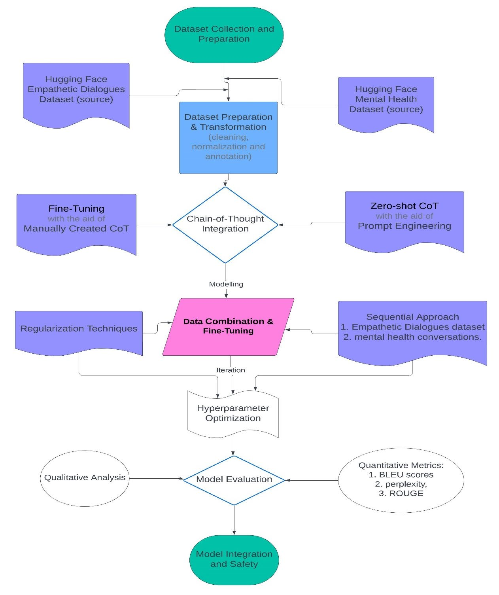
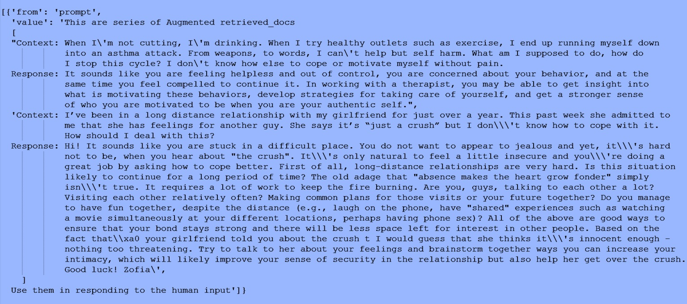

# Mental Health Chatbot with Chain of Thought (CoT) Reasoning

## Overview
This project is a mental health chatbot designed to provide empathetic and structured responses using Chain of Thought (CoT) reasoning. The chatbot classifies user emotions and provides supportive responses based on predefined prompts.

## Features
- **Emotion Detection**: Recognizes various emotional states (e.g., sad, anxious, excited, etc.).
- **Chain of Thought Reasoning**: Uses structured prompts to guide responses.
- **Mental Health Support**: Offers empathetic and constructive responses, including crisis intervention.
- **Customizable Responses**: Responses are stored in a JSON file for easy modification.

## Methodology
The chatbot follows a structured approach to classify user inputs and generate responses.



## Sentiment Analysis
The chatbot classifies emotions based on user inputs and presents insights through sentiment analysis.


## Model Responses
The chatbot is capable of generating different types of responses:

- **Simple Model Response**

  

- **CoT Model Response**

  

- **RAG Model Response**

  

## Files
- `ChatBot.ipynb`: Main notebook for chatbot development.
- `mental_health_LLM.ipynb`: Additional model training and evaluation notebook.
- `CoT_prompts.json`: JSON file containing structured prompts for various emotions.

## Installation
1. Clone the repository:
   ```sh
   git clone https://github.com/yourusername/mental-health-chatbot.git
   cd mental-health-chatbot
   ```
2. Install dependencies:
   ```sh
   pip install -r requirements.txt
   ```

## Usage
- Open `ChatBot.ipynb` and run the cells to interact with the chatbot.
- Modify `CoT_prompts.json` to customize responses.

## Future Improvements
- Integrate with a large language model (LLM) for more dynamic responses.
- Deploy as a web or mobile application.
- Improve emotion classification with machine learning models.

## License
This project is licensed under the MIT License.

## Acknowledgments
- Developed as part of an MSc Advanced Computer Science project.
- Thanks to mentors and collaborators who provided guidance.


